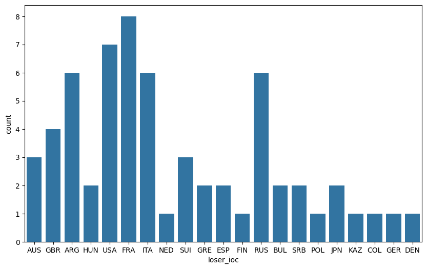
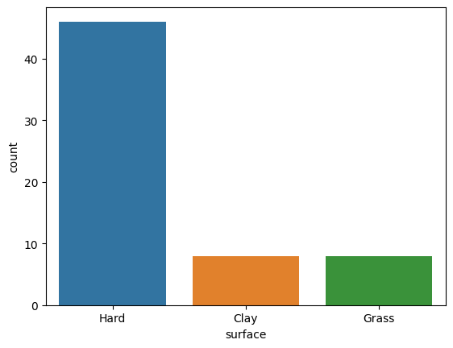
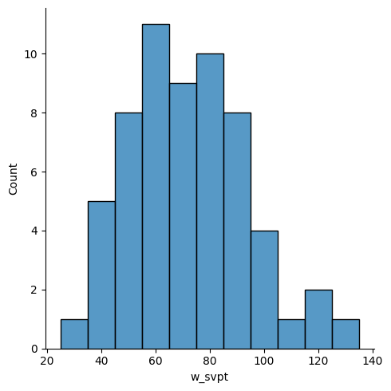
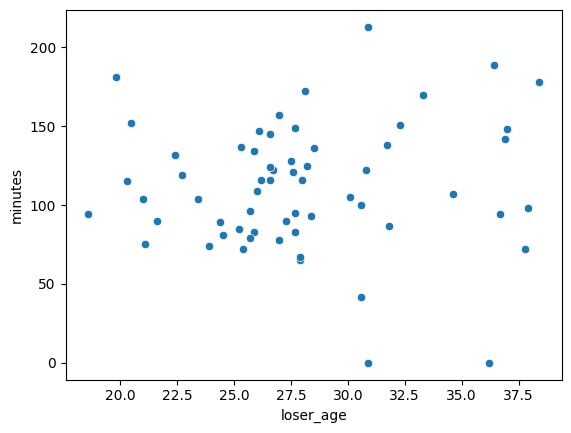
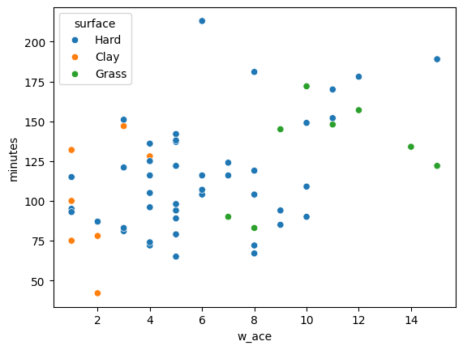
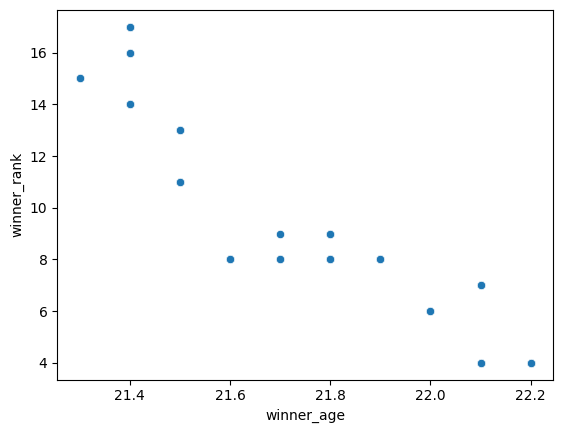

## What dataset did you use?

I used a public csv from Github that contains data on every ATP match played in the 2023 season: https://github.com/JeffSackmann/tennis_atp/blob/master/atp_matches_2023.csv

## What do you hope to learn from analyzing this dataset?

To narrow the scope of my analysis, I decided to focus solely on matches in this dataset that Jannik Sinner won, so I hoped to learn about his specific play style and his progression as a player over the course of the season.

## Analysis

1. The variables I looked at

My analysis included Sinner's age, his opponents' age, match duration (minutes), aces, serve points, ranking, opponents' countries of origin, and matches' court surface.

2. Distributions of variables

When observing centers and variability, I used seaborn and pandas to generate visual representations and make calculations respectively.

**The mode of his opponents' countries of origin is France**, as shown in this bar graph:

While this may seem like Sinner is simply better at playing against French and American opponents' it's critical to acknowledge that this bar chart does not account for the difference in total matches played against people of a certain nationality. Thus, this information doesn't help me draw any conclusions about Sinner's play style. However, if the bar chart displayed Sinner's win **rate**, which is a percentage adjusted for the total number of matches played against each nationality, the mode may be more indicative of an overall trend (or lack thereof)

**The mode of court surfaces in Sinner's wins is hard court**

Thus, it is likely that Sinner's play style is most suitable for hard courts, which are faster and have lower ball bounces than the other two surfaces. Importantly, the duration of the hard, grass, and clay seasons are approximately the same length, meaning that this graph likely displays an accurate trend.

Below is the **distribution of Sinner's points won on-serve per match**:

Visually, the data appears nearly zero skew, but it is slightly **skewed right** since the histogram's tail extends further to the right.

This skew can be verified by calculating the arithmetic mean and median of the data.

The **mean** = 71.8 points
The **median** = 70.5 points

Since a mean greater than the median is indicative of a skewed-right distribution, we can verify that the distribution of serve points per match is slightly skewed right.

3. Relationships between variables

When investigating the relationships between variables in the dataset, I first generated a **scatterplot of Sinner's opponents' age and the match duration**:

Since there is no consistent trend between changes in Sinner's opponents' ages and changes in the match duration, there is no statistically significant relationship between the two variables. Overall, the age of Sinner's opponent does not have an impact on the speed at which he is able to defeat them.

Then, I generated a scatterplot of **the number of Sinner's aces and the match duration**, with each observation categorized by court surface:

Firstly, it can be observed that there is a positive correlation between the number of Sinner's aces and the match duration -- the longer the match goes on, the more chances there are for Sinner to hit an ace.

Secondly, it can be observed that Sinner tends to hit more aces on grass courts than hard courts, and on hard courts than on clay courts, somewhat irrespective to match duration. Thus, it suggests that it is easiest for Sinner to hit an ace on grass courts. This conclusion makes sense because grass courts are known to be the best surface for big servers.

Moreover, I generated a scatterplot of **Sinner's age and rank**:

This graph shows a clear relationship between Sinner's age and his ranking. As Sinner got older, or as the season progressed, his ranking steadily climbed (and therefore decreased in numerical value). While one may conclude that this relationship means that getting older caused Sinner's rank to increase, this relationship is likely correlative and not causational, because there are many other factors that can contribute to an increase in ranking other than simply maturity.